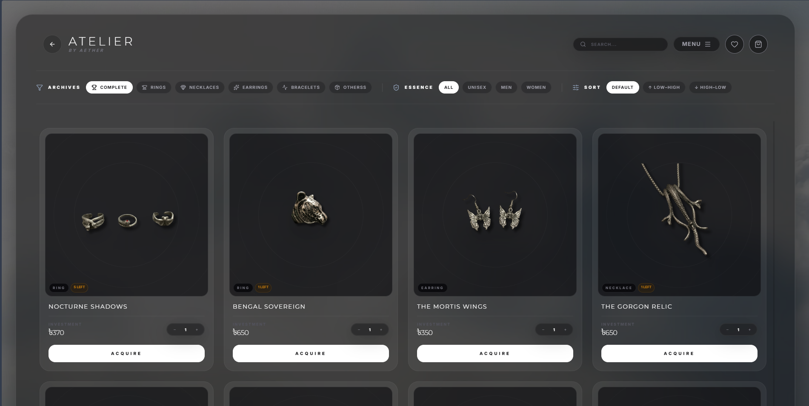
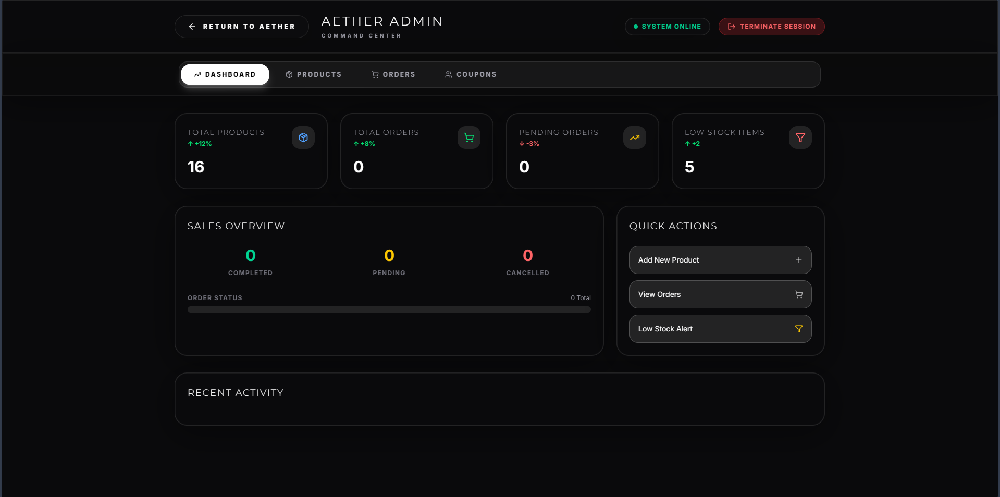
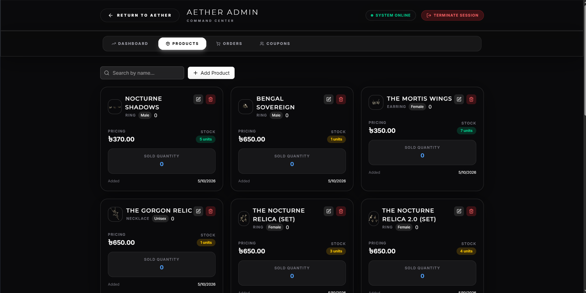
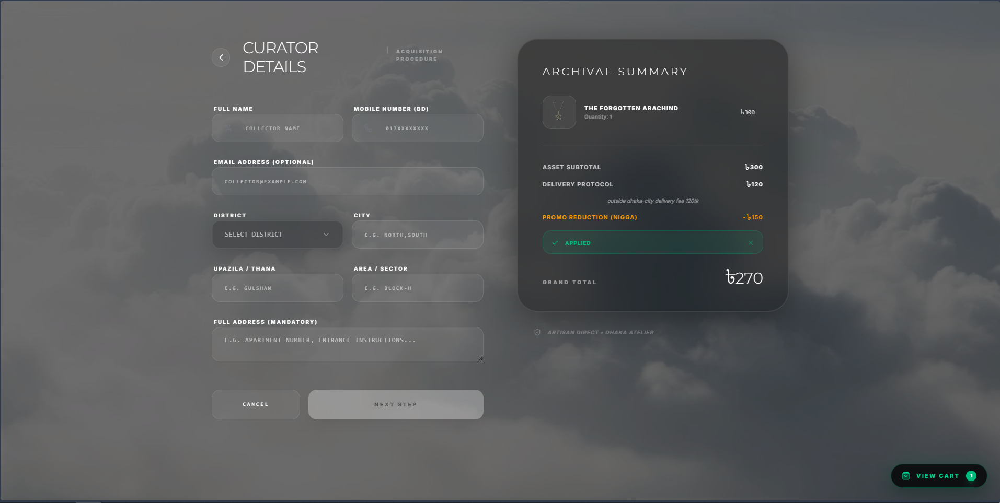
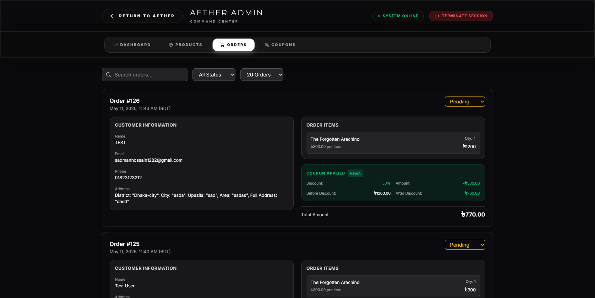
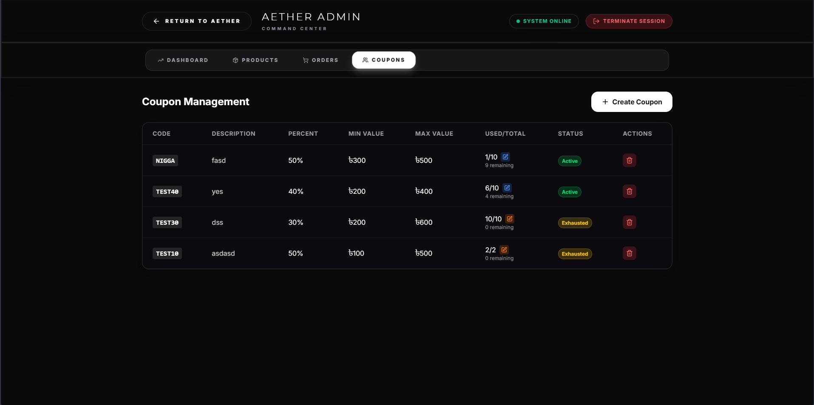
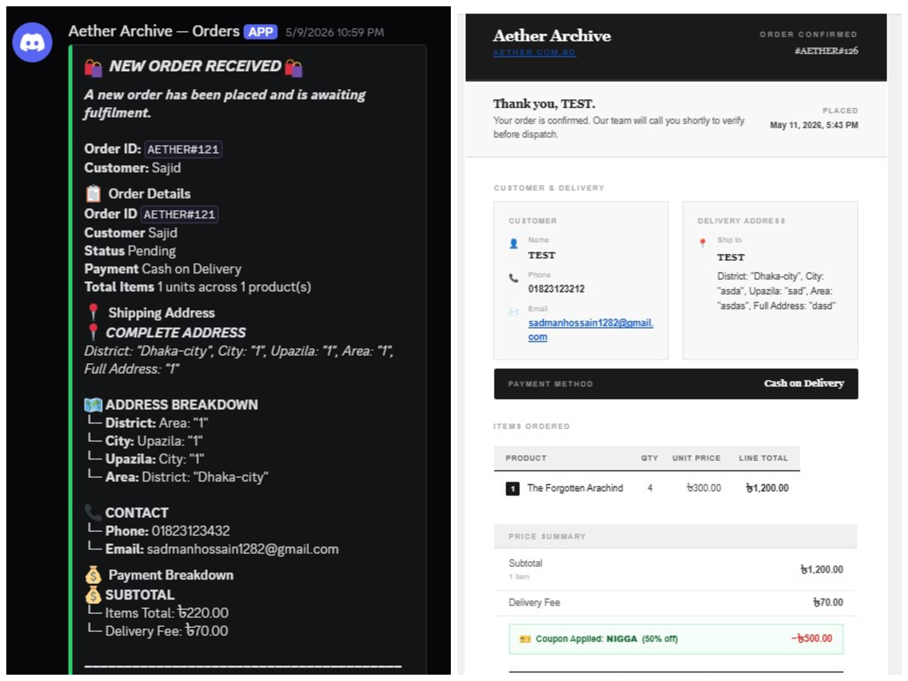

# AETHER ARCHIVE

> *Alternative Luxury Jewelry House - Above the Silence*

AETHER Archive is a sophisticated e-commerce platform for alternative-luxury jewelry, born in Dhaka and built at the intersection of ethereal minimalism and heavy, punk-inspired design. This full-stack application represents modern armor for the fiercely independent - quiet power forged in the dark, worn in the light.

## 🌟 Live Demo

**Experience AETHER Archive:** [https://aether.com.bd/](https://aether.com.bd/)

> **⚠️ Source Code Notice:** This repository contains the complete source code of AETHER Archive for documentation purposes only. The source code is **not owned by the repository maintainer** and cannot be shared, modified, or redistributed. For the live experience, please visit the demo link above.

## 🖼️ Gallery

<div align="center">

<!-- Main Store Interface -->


<!-- Product Gallery -->


<!-- Admin Dashboard -->


<!-- Product Management -->


<!-- Order Processing -->


<!-- Customer Support -->


<!-- Discord & Mail Integration -->
Discord and Mail


</div>

## ✨ Core Features

### 🛍️ **Customer Experience**
- **Immersive Shopping Interface** - Dark, ethereal design with animated video backgrounds
- **Advanced Product Gallery** - High-quality image zoom, multiple product views, and smart image fallbacks
- **Seamless Cart Management** - Real-time inventory tracking and quantity controls
- **Secure Checkout** - Complete order processing with shipping details and coupon support
- **Social Sharing** - Facebook integration for product broadcasting to chronology, stories, and inbox
- **Mobile Optimized** - Fully responsive design with touch-friendly interactions

### 🎯 **Product Management**
- **Dynamic Inventory** - Real-time stock tracking with low stock alerts
- **Limited Edition Items** - Special handling for exclusive products
- **Multi-Image Support** - Up to 5 product images with automatic fallback
- **Category Organization** - Rings, Necklaces, Bracelets, and more
- **Gender-Based Filtering** - M/F/Unisex product categorization
- **Discount System** - Percentage-based pricing with visual indicators

### 🛠️ **Admin Command Center**
- **Comprehensive Dashboard** - Real-time metrics and analytics
- **Order Management** - Complete order lifecycle from pending to completion
- **Product CRUD Operations** - Full create, read, update, delete capabilities
- **Bulk Image Upload** - Multi-file product image management
- **Coupon System** - Create and manage discount codes with usage tracking
- **Sales Analytics** - Detailed order statistics and product performance metrics

### 🏗️ **Technical Architecture**
- **Modern Frontend** - React 19 with TypeScript, Motion animations, and TailwindCSS
- **Robust Backend** - Node.js + Express with comprehensive API endpoints
- **Database Design** - MySQL with optimized schema for products, orders, and coupons
- **File Management** - Secure image storage with organized directory structure
- **Production Ready** - Optimized build process and deployment configuration

## 🏛️ Brand Philosophy

> *"Born in the heart of Dhaka, AETHER is an alternative-luxury jewelry house built on the power of contrast. We exist at the intersection of ethereal minimalism and heavy, punk-inspired design. We believe that true luxury doesn't scream for attention; it commands it in silence."*

### Our Mission
To forge modern armor for the vanguard. We exist to equip our community with heavy, unapologetic artifacts that cut through the clutter of fast fashion and fleeting trends.

### Our Vision  
To redefine alternative luxury from the East to the rest of the world. We envision AETHER not just as a jewelry house, but as a definitive global mindset originating from Dhaka.

### Core Values
- **Integrity** - Punk-Inspired
- **Craft** - Quiet Power  
- **Aesthetic** - Ethereal
- **Legacy** - Armor

## 🏗️ Technical Architecture

### Frontend Stack
```
React 19 + TypeScript
├── Motion (Framer Motion) - Advanced animations
├── TailwindCSS 4.1 - Utility-first styling
├── Lucide React - Icon system
├── Vite 6.2 - Build tool & dev server
└── HLS.js - Video streaming support
```

### Backend Stack
```
Node.js + Express
├── MySQL 2 - Database connectivity
├── Multer - File upload handling
├── Nodemailer - Email services
├── CORS - Cross-origin resource sharing
└── dotenv - Environment configuration
```

### Database Schema
```sql
Products (id, name, description, quantity, category, limited, image_path, p_price, gender)
Orders (id, customer_name, address, email, status, total_amount, phone, coupon_id)
Order Items (id, order_id, product_id, quantity, unit_price)
Coupons (coupon_id, coupon_code, description, percent, minimum_value, maximum_value, quantity)
```

## 📁 Project Structure

```
aether-archive/
├── 📂 src/                     # React frontend source
│   ├── 📂 components/          # UI components
│   │   ├── AboutPage.tsx      # Brand story page
│   │   ├── AdminPanel.tsx     # Admin command center
│   │   ├── CheckoutView.tsx   # Shopping cart & checkout
│   │   └── ErrorBoundary.tsx  # Error handling
│   ├── 📂 hooks/              # Custom React hooks
│   ├── 📂 services/           # API service layer
│   ├── App.tsx               # Main application component
│   └── ShopContext.tsx       # Global state management
├── 📂 server/                  # Express backend
│   ├── 📂 config/             # Database configuration
│   ├── 📂 middleware/         # Custom middleware
│   ├── 📂 routes/             # API route handlers
│   ├── 📂 services/           # Business logic services
│   ├── 📂 product_picture/    # Product image storage
│   └── index.js              # Main server entry point
├── 📂 database/                # Database schema & migrations
│   └── schema.sql             # Complete database structure
├── 📂 public/                  # Static assets
│   └── Flow_202604171737.mp4  # Background video
├── 📂 dist/                    # Production build output
├── package.json               # Root dependencies & scripts
├── vite.config.ts             # Vite configuration
├── tsconfig.json              # TypeScript configuration
└── .env.example               # Environment variables template
```

## 🚀 Quick Start

### Prerequisites
- Node.js 18+ 
- MySQL 8.0+
- npm or yarn

### Installation
```bash
# Clone and setup
git clone <repository-url>
cd aether-archive
npm run setup                    # Install all dependencies
```

### Database Setup
```bash
# Create database and import schema
mysql -u root -p -e "CREATE DATABASE aether_db;"
mysql -u root -p aether_db < database/schema.sql
```

### Environment Configuration

```bash
# Copy environment template
cp .env.example .env

# Edit .env with your credentials
```

#### 📝 Environment Variables Template (.env.example)

```env
# MySQL Database Configuration (for cPanel hosting)
DB_HOST=localhost
DB_USER=your_database_username
DB_PASSWORD=your_database_password
DB_NAME=aether_db
DB_PORT=3306

# Admin Credentials (CHANGE THESE FOR PRODUCTION!)
ADMIN_USERNAME=your_admin_username
ADMIN_PASSWORD=your_admin_password

# Server Configuration
#PORT=5000
NODE_ENV=production

# Discord Webhook (optional)
DISCORD_WEBHOOK_URL=your_discord_webhook_url

# Email Configuration (for order confirmations)
SMTP_HOST=your_smtp_host
SMTP_PORT=587
SMTP_SECURE=false
SMTP_USER=your_email_address
SMTP_PASS=your_email_password
SMTP_FROM=your_from_email_address
```

**⚠️ Important Security Notes:**
- Always change default admin credentials in production
- Use strong, unique passwords for database access
- Configure email settings for order confirmations
- Set up Discord webhook for admin notifications (optional)
- Ensure `NODE_ENV=production` for live deployment

### Development
```bash
# Start development servers (frontend :5173, backend :5000)
npm run dev
```

### Production
```bash
# Build and deploy
npm run build
npm start
```

## 🔐 Admin Access

The admin panel provides comprehensive management capabilities:

**Login:** `/admin` route  
**Credentials:** Configure in `.env` file

**Features:**
- 📊 Real-time dashboard metrics
- 📦 Product inventory management  
- 🛒 Order processing and tracking
- 🎫 Coupon creation and management
- 📈 Sales analytics and reporting
- 🖼️ Bulk image upload system

## 🛡️ Security Features

- **Admin Authentication** - Secure login system
- **File Upload Validation** - Image type and size restrictions
- **SQL Injection Protection** - Parameterized queries
- **CORS Configuration** - Controlled cross-origin access
- **Environment Variables** - Sensitive data protection
- **Error Handling** - Comprehensive error boundaries

## 📱 Mobile Optimization

- **Responsive Design** - Mobile-first approach
- **Touch Interactions** - Optimized for touch devices
- **Performance** - Lazy loading and code splitting
- **Progressive Enhancement** - Core functionality on all devices

## 🎨 Design System

### Visual Identity
- **Color Palette:** Dark ethereal theme with high contrast
- **Typography:** Custom display fonts with tracking optimization
- **Animations:** Smooth motion transitions and micro-interactions
- **Layout:** Grid-based responsive design system

### Component Library
- **Glass Morphism** - Translucent UI elements
- **Liquid Effects** - Fluid animations and transitions
- **Video Backgrounds** - Immersive visual experiences
- **Icon System** - Consistent Lucide React integration

## 🚀 Deployment & Scaling

### Production Optimization
```bash
# Optimized production build
npm run build

# Environment variables for production
NODE_ENV=production
PORT=5000
```

### Performance Features
- **Code Splitting** - Optimized bundle sizes
- **Image Optimization** - Smart fallback and compression
- **Caching Strategy** - Efficient asset delivery
- **Database Indexing** - Optimized query performance

## 📊 Analytics & Monitoring

### Built-in Metrics
- **Sales Performance** - Order completion rates
- **Inventory Tracking** - Stock level monitoring
- **Customer Behavior** - Shopping patterns
- **Product Performance** - Popular items analysis

### Admin Dashboard
- **Real-time Updates** - Live data synchronization
- **Visual Analytics** - Charts and progress indicators
- **Export Capabilities** - Data export functionality

## 🔧 API Documentation

### Product Endpoints
```
GET    /api/products           # Fetch all products
POST   /api/admin/products     # Create product (admin)
PUT    /api/admin/products/:id # Update product (admin)
DELETE /api/admin/products/:id # Delete product (admin)
```

### Order Management
```
GET    /api/admin/orders       # Fetch orders (admin)
POST   /api/createOrder        # Create new order
PATCH  /api/admin/orders/:id/status # Update order status
```

### Coupon System
```
GET    /api/admin/coupons      # Fetch coupons (admin)
POST   /api/admin/coupons      # Create coupon (admin)
PUT    /api/admin/coupons/:id  # Update coupon (admin)
DELETE /api/admin/coupons/:id  # Delete coupon (admin)
```

## 🌟 Live Experience

**🔗 [Experience AETHER Archive Live]([https://aetherrs.link](https://aether.com.bd))**

> **Important Notice:** This repository is provided for documentation and educational purposes only. The source code is proprietary and cannot be shared, modified, or redistributed. For the complete AETHER experience, please visit our live platform.

---

<div align="center">

**© 2026 AETHER ARCHIVE**  
*Forged in the Void • Dhaka Atelier*

</div>
